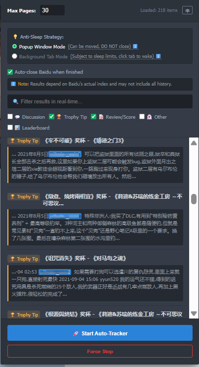
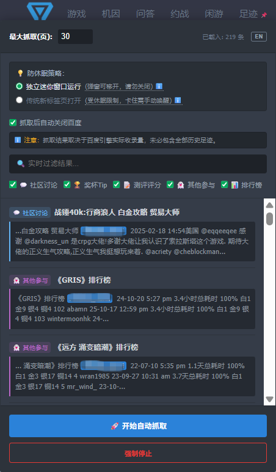

# PSNINE Activity Tracker - AutoPilot 🚀

A customized Tampermonkey user script designed for [PSNINE](https://psnine.com/). **The script is activated exclusively on PSNINE user profile pages (e.g., `https://www.psnine.com/psnid/{user_id}`).** It automates the retrieval of Baidu search results to mine and track the historical footprint of a specified PSN ID on P9 (including community discussions, trophy tips, review scores, etc.).

这是一个为 [PSNINE](https://psnine.com/) 定制的 Tampermonkey 用户脚本。**脚本会在 PSNINE 的用户个人主页（例如：`https://www.psnine.com/psnid/{user_id}`）被自动激活。** 通过自动化抓取百度搜索的结果，一键挖掘并追踪指定 PSN ID 在 P9 的历史活动足迹（包括社区讨论、奖杯 Tip、测评评分等）。

## 📸 Screenshots / 运行截图

## ✨ Features & Tech Specs / 核心功能与技术特性

* **🤖 Unattended AutoPilot Fetching:** Bypasses conventional pagination limits, automatically climbing and cross-page fetching until the physical limit is reached.
* **🛡️ Strict Mode Filtering:** Eliminates invalid spam to accurately lock onto the target's actual interactions.
* **🎛️ Bypassing Background Tab Throttling:** Modern browsers (Chrome, Edge) heavily penalize inactive background tabs to save RAM/battery, freezing timers and pending AJAX requests. This script implements an "Independent Popup Window Strategy," forcing the browser to treat it as an active foreground process, ensuring maximum speed without freezing.
* **⚙️ SPA Architecture & Physical Click Simulation:** Baidu Search is a Single Page Application (SPA) utilizing PJAX (PushState + AJAX). To handle this, the script abandons traditional URL redirection. Instead, a Background Radar (State Machine) constantly monitors the `pn` parameter. Once the new DOM stabilizes, it accurately simulates a physical button click (`click()`) to perfectly trigger frontend event listeners.
* **🧩 Native UI Integration:** Seamlessly embeds a floating control panel into the PSNINE top navigation bar, featuring real-time keyword and category filtering.
* **⚡ Smart Deduplication & Highlighting:** Automatically records hashes of retrieved data to skip duplicates and highlights the target PSN ID within long texts.

---

* **🤖 全自动无人值守抓取：** 突破常规翻页限制，自动爬坡、跨页检索，直至物理极限。
* **🛡️ Strict Mode 严格过滤：** 剔除无效垃圾信息，精准锁定目标动态。
* **🎛️ 突破浏览器后台休眠限制：** 现代浏览器（如 Chrome、Edge）会严格限制后台标签页的性能，导致计时器冻结和 AJAX 请求挂起。本脚本采用“独立迷你窗口 (Popup)”策略，强制浏览器将其识别为前台活跃进程，确保全速运行不卡死。
* **⚙️ 适配 SPA 架构与物理点击模拟：** 针对百度搜索底层的 PJAX（PushState + AJAX）单页无刷新机制，脚本彻底摒弃了传统的暴力 URL 跳转。内置状态机（State Machine）持续监听 `pn` 参数变化，并在 DOM 稳定后精准模拟真实的物理按键点击（`click()`），完美触发前端事件监听。
* **🧩 原生 UI 深度融合：** 完美嵌入 PSNINE 顶部导航栏，悬浮面板随叫随到，支持实时关键词与标签过滤。
* **⚡ 智能排重与高亮：** 自动记录已检索数据跳过重复项，并在长文本中高亮目标 PSN ID。

## 📥 Installation / 安装指南

1. Ensure you have the [Tampermonkey](https://www.tampermonkey.net/) extension installed in your browser.
2. Click the link below to prompt the one-click installation:

**👉 [Install Script / 一键安装脚本](https://github.com/KlausVorutsu/psnine-activity-tracker/raw/refs/heads/main/psnine-activity-tracker.user.js)**

---

1. 请确保你的浏览器已安装 [Tampermonkey](https://www.tampermonkey.net/) 扩展。
2. 点击上方链接即可一键拉起安装界面。

## 🛠️ Usage / 使用说明

1. After installation, navigate to any user's PSNINE profile page (e.g., `https://www.psnine.com/psnid/{ps_user}`). **Note: The script UI is only injected on these specific profile URLs.**
2. Hover over the newly added **"Footprint" (足迹)** button on the top navigation bar to expand the control panel.
3. Set your desired maximum scrape pages and run mode. **We strongly recommend keeping the default "Independent Popup Window" mode.**
   > **💡 Why use the Popup Window?** If you choose "New Tab" and let it run in the background, the modern browser's memory-saving mechanics will quickly freeze the fetching progress. A popup window acts as a foreground task, keeping the SPA state machine running smoothly.
4. Click **🚀 Start Auto Fetch (开始自动抓取)** and let the script take over.

---

1. 安装完成后，进入任意用户的 PSNINE 个人主页（例如：`https://www.psnine.com/psnid/{ps_user}`）。**注意：脚本仅在此类用户主页下激活。**
2. 鼠标悬停在顶部导航栏新增的 **「足迹」** 按钮上，展开控制面板。
3. 按需设置最大抓取页数及运行模式。**强烈推荐保持默认的「独立迷你窗口」运行**。
   > **💡 为什么要用迷你窗口？** 如果选择“传统新标签页”并在后台运行，现代浏览器的内存节省机制会迅速冻结该页面的抓取进度。迷你窗口即使被你移出主屏幕视线，也会被系统判定为前台任务，从而保证脚本顺畅跑完全程。
4. 点击 **🚀 开始自动抓取**，脚本将接管后续工作。

## ⚠️ Disclaimer / 免责声明

This script is for educational and personal use only. The scraping results depend on the search engine's indexing and cache policies, meaning it does not represent the complete historical footprint of a user. Please control your scraping frequency reasonably to avoid putting unnecessary pressure on the target websites.

本脚本仅供学习交流使用。抓取结果依赖于搜索引擎的实际收录量与缓存策略，不代表用户的完整历史足迹。请合理控制抓取频率，避免对目标网站造成不必要的压力。
